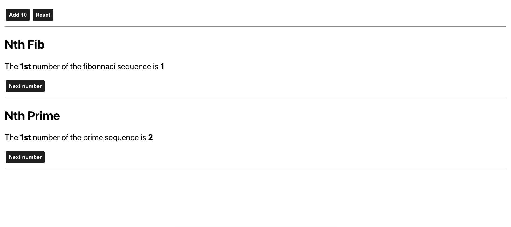

# Fibonacci and prime numbers

This project was bootstrapped with [Create React App](https://github.com/facebook/create-react-app). This app was created to practice React.memo, useCallback and the useMemo hook.

## Available Scripts

In the project directory, you can run:

### `npm start`

Runs the app in the development mode.\
Open [http://localhost:3000](http://localhost:3000) to view it in your browser.

The page will reload when you make changes.

